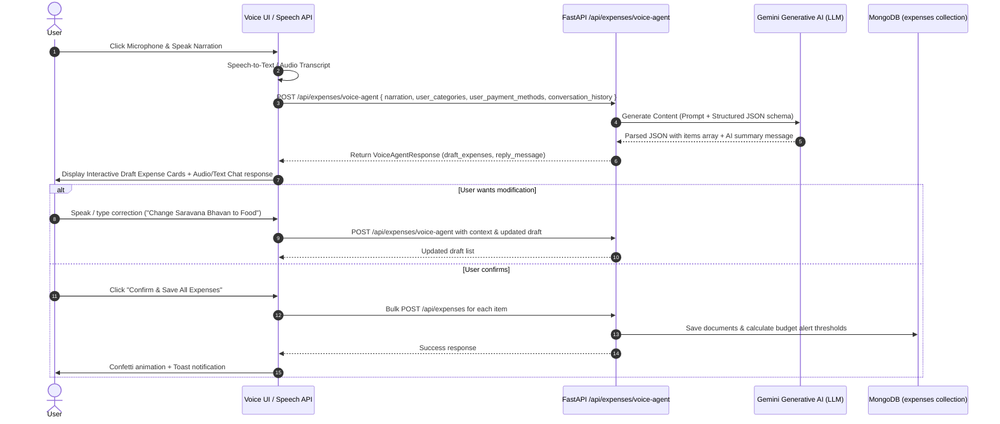

# MyMoney - Voice AI Agent Specification & Integration Guide

## 1. Overview & Vision
The **Voice AI Agent** transforms MyMoney from a manual form-filling expense tracker into an interactive, voice-driven AI financial assistant ("Agentic MyMoney"). 

Instead of typing amounts, dates, categories, and descriptions line-by-line, the user simply opens the Voice Agent modal or floating widget and narrates their daily spending in natural spoken language or text:
> *"Today at Reliance Smart I spent 450 rupees on groceries with UPI. Then I ate lunch at Saravana Bhavan for 180 rupees cash, and paid 50 rupees for auto."*

The AI Voice Agent processes the audio/narration in real-time, extracts all distinct expense items with high accuracy, categorizes them automatically, and presents an interactive draft for user review, voice-editing, and single-click bulk saving.

---

## 2. Conversation & Extraction Lifecycle

---

## 3. Data Schemas

### Request Schema (`VoiceAgentRequest`)
- `narration` (string): Spoken text or typed input from user.
- `existing_drafts` (list of ExpenseCreate): Optional draft list from previous interaction turn.
- `categories` (list of strings): Available categories in user's MyMoney account.
- `payment_methods` (list of strings): Available payment methods in user's account.
- `currency` (string): User preferred currency (e.g. ₹ or $).

### Response Schema (`VoiceAgentResponse`)
- `reply_message` (string): Conversational AI agent response (e.g., *"I extracted 3 expense items from your narration. Please review them below!"*).
- `extracted_expenses` (list of draft items):
  - `title`: Vendor or item name
  - `amount`: Numeric cost
  - `category`: Matching user category (or fallback to "Food"/"Grocery"/"Other")
  - `payment_method`: Matching payment method (e.g. "UPI", "Cash", "Credit Card")
  - `date`: Inferred YYYY-MM-DD
  - `time`: Inferred HH:MM
  - `location`: Vendor location if mentioned
  - `description`: Notes or itemized breakdown
- `confidence`: Extraction confidence score (0.0 to 1.0)
- `requires_clarification`: Boolean flag if amount or category is ambiguous.

---

## 4. Key UI Features

1. **Pulse Ring Microphone Visualizer**: Animated glowing ring when recording audio.
2. **Real-time Web Speech Recognition**: Automatic browser speech-to-text fallback + manual text prompt input.
3. **Interactive Draft Cards**:
   - Inline editing for amount, title, category, payment method, and date.
   - Delete single draft item button.
   - "Add item manually" button.
4. **Conversational Assistant Bubbles**: Agent response text with audio playback option (Text-to-Speech).
5. **One-click Batch Persistence**: Direct creation in MongoDB + budget checks + audit log entry.
